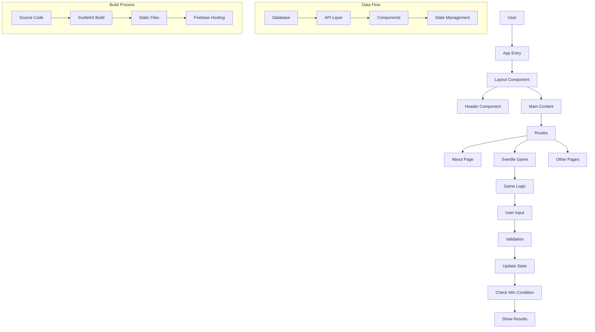
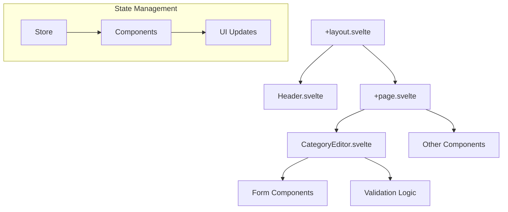
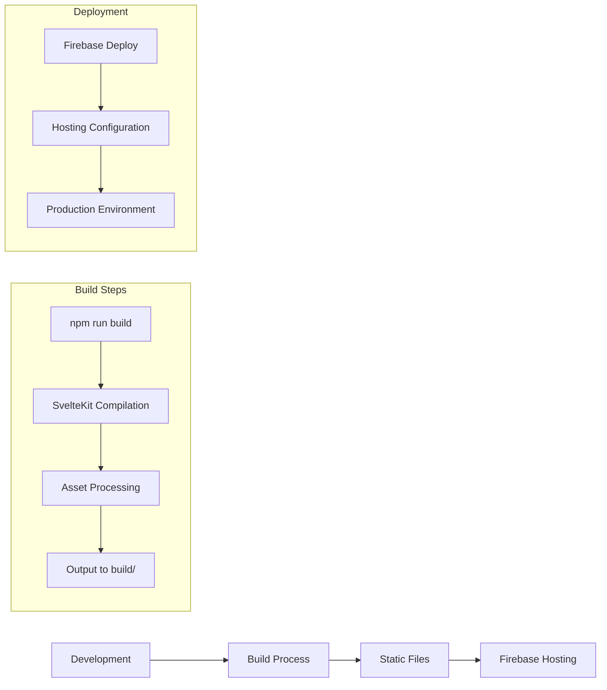

# Application Flow Diagram

```mermaid
graph TD
    A[User] --> B[App Entry]
    B --> C[Layout Component]
    C --> D[Header Component]
    C --> E[Main Content]
    
    E --> F[Routes]
    F --> G[About Page]
    F --> H[Sverdle Game]
    F --> I[Other Pages]
    
    H --> J[Game Logic]
    J --> K[User Input]
    K --> L[Validation]
    L --> M[Update State]
    M --> N[Check Win Condition]
    N --> O[Show Results]
    
    subgraph "Data Flow"
        P[Database] --> Q[API Layer]
        Q --> R[Components]
        R --> S[State Management]
    end
    
    subgraph "Build Process"
        T[Source Code] --> U[SvelteKit Build]
        U --> V[Static Files]
        V --> W[Firebase Hosting]
    end
```

## Component Structure

```mermaid
graph TD
    A[+layout.svelte] --> B[Header.svelte]
    A --> C[+page.svelte]
    
    C --> D[CategoryEditor.svelte]
    C --> E[Other Components]
    
    D --> F[Form Components]
    D --> G[Validation Logic]
    
    subgraph "State Management"
        H[Store] --> I[Components]
        I --> J[UI Updates]
    end
```

## Build and Deployment Flow

```mermaid
graph LR
    A[Development] --> B[Build Process]
    B --> C[Static Files]
    C --> D[Firebase Hosting]
    
    subgraph "Build Steps"
        E[npm run build] --> F[SvelteKit Compilation]
        F --> G[Asset Processing]
        G --> H[Output to build/]
    end
    
    subgraph "Deployment"
        I[Firebase Deploy] --> J[Hosting Configuration]
        J --> K[Production Environment]
    end
``` 