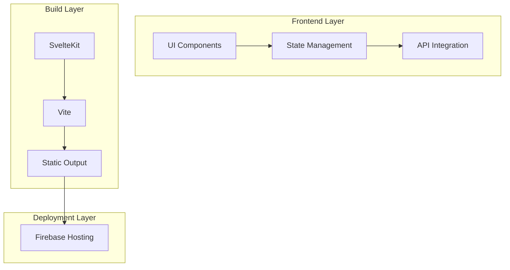
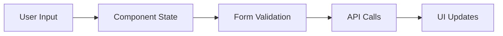

# High-Level Design Document

## 1. System Overview

The application is a SvelteKit-based web application that provides a menu management system with a game component (Sverdle). It's designed to be deployed on Firebase hosting with a static site architecture.

## 2. Architecture

### 2.1 Technology Stack
- **Frontend Framework**: SvelteKit 2.x
- **Build Tool**: Vite
- **Deployment**: Firebase Hosting
- **Styling**: TailwindCSS
- **Testing**: Vitest, Playwright
- **Documentation**: Storybook

### 2.2 Key Components

## 3. Core Features

### 3.1 Menu Management
- Category editing and management
- Dynamic form validation
- Real-time preview capabilities
- Grid API integration

### 3.2 Sverdle Game
- Word guessing game implementation
- State management for game progress
- Win condition checking
- Confetti animation for winners

## 4. Component Architecture

### 4.1 Layout Structure
- Root layout (`+layout.svelte`)
- Header component
- Main content area
- Dynamic routing

### 4.2 Key Components
- `CategoryEditor.svelte`: Form-based category management
- `Header.svelte`: Navigation and app header
- Game components for Sverdle
- Form validation components

## 5. State Management

### 5.1 Data Flow

### 5.2 State Patterns
- Component-level state
- Form state management
- Game state tracking
- API response handling

## 6. Build and Deployment

### 6.1 Build Process
1. SvelteKit compilation
2. Asset processing
3. Static file generation
4. Firebase deployment

### 6.2 Environment Configuration
- Development environment
- Production environment
- Environment variables management

## 7. Testing Strategy

### 7.1 Test Types
- Unit tests (Vitest)
- Component tests
- E2E tests (Playwright)
- Storybook visual tests

### 7.2 Test Coverage
- Component functionality
- Form validation
- Game logic
- API integration

## 8. Performance Considerations

### 8.1 Optimization Strategies
- Static site generation
- Asset optimization
- Lazy loading
- Code splitting

### 8.2 Caching
- Static asset caching
- API response caching
- Browser caching strategies

## 9. Security

### 9.1 Security Measures
- Input validation
- XSS prevention
- CSRF protection
- Secure API communication

## 10. Future Considerations

### 10.1 Scalability
- Component modularity
- State management scalability
- API integration extensibility

### 10.2 Maintenance
- Code organization
- Documentation
- Testing coverage
- Performance monitoring

## 11. Development Workflow

### 11.1 Development Process
1. Local development
2. Testing
3. Build verification
4. Deployment

### 11.2 Quality Assurance
- Code review process
- Testing requirements
- Documentation standards
- Performance benchmarks 