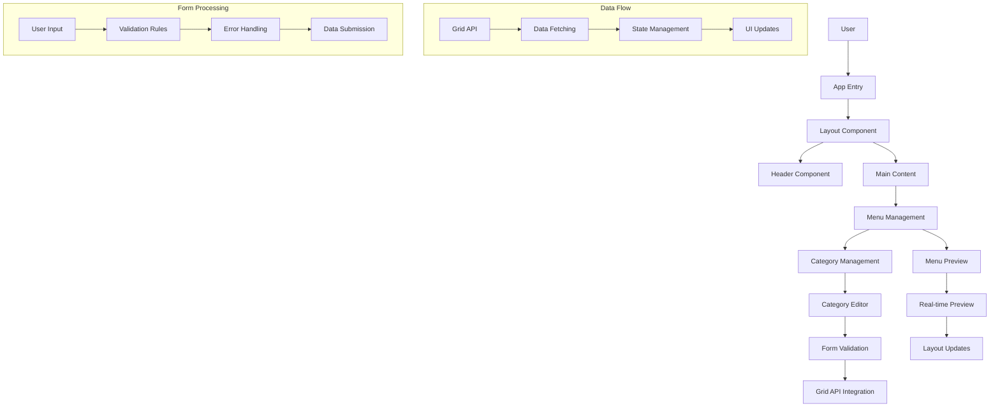
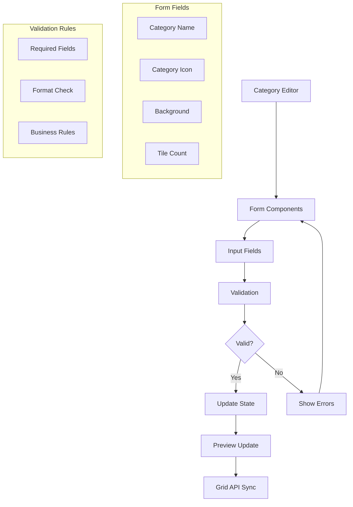
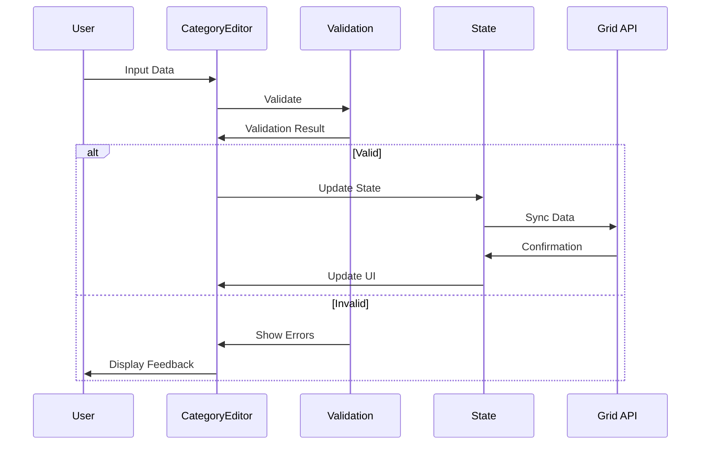
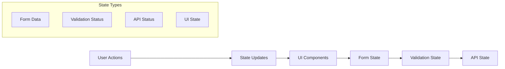
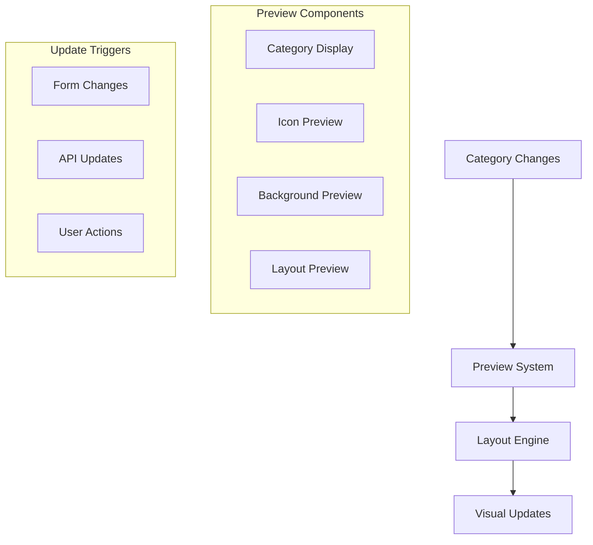

# Menu Management System Flow

## Main Application Flow

```mermaid
graph TD
    A[User] --> B[App Entry]
    B --> C[Layout Component]
    C --> D[Header Component]
    C --> E[Main Content]
    
    E --> F[Menu Management]
    F --> G[Category Management]
    F --> H[Menu Preview]
    
    G --> I[Category Editor]
    I --> J[Form Validation]
    J --> K[Grid API Integration]
    
    H --> L[Real-time Preview]
    L --> M[Layout Updates]
    
    subgraph "Data Flow"
        N[Grid API] --> O[Data Fetching]
        O --> P[State Management]
        P --> Q[UI Updates]
    end
    
    subgraph "Form Processing"
        R[User Input] --> S[Validation Rules]
        S --> T[Error Handling]
        T --> U[Data Submission]
    end
```

## Category Management Flow

```mermaid
graph TD
    A[Category Editor] --> B[Form Components]
    B --> C[Input Fields]
    C --> D[Validation]
    
    D --> E{Valid?}
    E -->|Yes| F[Update State]
    E -->|No| G[Show Errors]
    G --> B
    
    F --> H[Preview Update]
    H --> I[Grid API Sync]
    
    subgraph "Form Fields"
        J[Category Name]
        K[Category Icon]
        L[Background]
        M[Tile Count]
    end
    
    subgraph "Validation Rules"
        N[Required Fields]
        O[Format Check]
        P[Business Rules]
    end
```

## API Integration Flow

```mermaid
sequenceDiagram
    participant U as User
    participant C as CategoryEditor
    participant V as Validation
    participant S as State
    participant A as Grid API
    
    U->>C: Input Data
    C->>V: Validate
    V->>C: Validation Result
    
    alt Valid
        C->>S: Update State
        S->>A: Sync Data
        A->>S: Confirmation
        S->>C: Update UI
    else Invalid
        V->>C: Show Errors
        C->>U: Display Feedback
    end
```

## State Management Flow

```mermaid
graph LR
    A[User Actions] --> B[State Updates]
    B --> C[UI Components]
    C --> D[Form State]
    D --> E[Validation State]
    E --> F[API State]
    
    subgraph "State Types"
        G[Form Data]
        H[Validation Status]
        I[API Status]
        J[UI State]
    end
```

## Preview System Flow

```mermaid
graph TD
    A[Category Changes] --> B[Preview System]
    B --> C[Layout Engine]
    C --> D[Visual Updates]
    
    subgraph "Preview Components"
        E[Category Display]
        F[Icon Preview]
        G[Background Preview]
        H[Layout Preview]
    end
    
    subgraph "Update Triggers"
        I[Form Changes]
        J[API Updates]
        K[User Actions]
    end
``` 